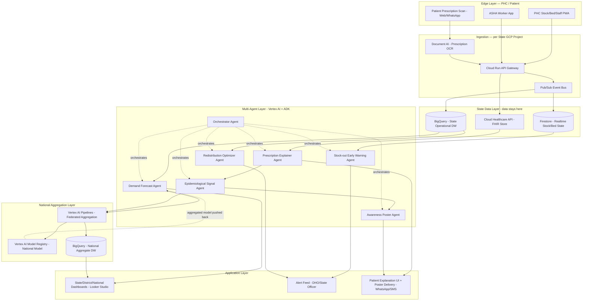

# Architecture — ArogyaGrid

## 1. Design Principles

1. **Federated by boundary, unified by API.** Each state's operational data lives in its own Google Cloud project (data residency + sovereignty). Only model weights, gradients, and pre-approved aggregate statistics cross into the national layer.
2. **Agentic, not scripted.** Every AI capability is an autonomous agent with its own tools, memory, and reasoning — coordinated by an orchestrator, not a single monolithic prompt.
3. **Interoperable by default.** All clinical/administrative data is modeled FHIR-compatible so the platform can plug into ABDM, e-Aushadhi, IHIP, and HMIS without a redesign.
4. **Offline-tolerant edges.** PHCs have patchy connectivity; the edge app queues writes and syncs when online.
5. **Serverless-first.** No infrastructure a state IT cell has to maintain — everything runs on managed Google Cloud services.

## 2. High-Level System Diagram

## 3. The Federated Loop (how state-to-national actually works)

1. Each state's Vertex AI Pipeline trains/fine-tunes its local forecasting model on that state's own BigQuery data — data never leaves the project.
2. Only model weight deltas (or, for the hackathon demo, summary statistics/embeddings) are pushed to a national Vertex AI Pipelines job on a schedule (e.g., nightly).
3. The national pipeline performs federated averaging, producing an updated national model.
4. The national model is pushed back down to each state via Vertex AI Model Registry, giving every state the benefit of patterns learned elsewhere (e.g., a dengue-consumption signature discovered in Kerala helps Odisha forecast better before its own outbreak) — without ever exposing Kerala's raw patient/stock records to Odisha or to the center.
5. For the hackathon demo, this is simulated with 2 mock "state" BigQuery datasets and one aggregation pipeline run, with the architecture and code structured so a real 28-state rollout is a configuration change, not a redesign.

## 4. Data Model (core entities, FHIR-aligned)

- `PHC` — id, district, state, geo, category (Type A/B/C)
- `InventoryItem` — PHC_id, drug_id (linked to `Medicine`), batch, quantity, unit, last_updated
- `Medicine` — drug_id, generic_name, molecule/composition, therapeutic_class, manufacturer, essential_drug_flag
- `BedStatus` — PHC_id, ward_type, total, occupied, timestamp
- `StaffAttendance` — PHC_id, role, present_count, sanctioned_count, timestamp
- `PrescriptionEvent` (de-identified after consent) — anonymized_patient_hash, PHC/clinic_id, drug_ids[], diagnosis_class (if available), geo (block-level), timestamp — this is the row that feeds the Epidemiological Signal Agent
- `Alert` — type (stock-out/bed/staff), PHC_id, drug_id, predicted_date, confidence, status
- `RedistributionRecommendation` — from_PHC, to_PHC, drug_id, qty, rationale, status

## 5. Google Technology Stack

| Layer | Google Technology | Why |
|---|---|---|
| Multi-agent orchestration | **Vertex AI Agent Builder / Agent Development Kit (ADK)**, Gemini 2.x models | Purpose-built for multi-agent tool-using systems with shared session/state |
| Reasoning / language tasks | **Gemini API (via Vertex AI)** | Multimodal (reads prescription images directly), strong multilingual reasoning for Indian languages |
| Prescription OCR | **Document AI** | Handles handwritten/printed prescription extraction better than generic OCR |
| Forecasting | **Vertex AI Forecasting / BigQuery ML (ARIMA_PLUS, boosted trees)** | Managed time-series forecasting at scale, per-PHC per-drug |
| Poster/visual generation | **Imagen 3 (via Vertex AI)** | Text-to-image for localized awareness posters |
| Multilingual delivery | **Cloud Translation API + Text-to-Speech** | 22 scheduled languages; voice output for low-literacy users |
| Real-time data bus | **Pub/Sub** | Decouples edge writes from downstream processing; handles PHC connectivity gaps via retry |
| Data warehouse | **BigQuery** (per-state project + national aggregate project) | Federation boundary; native row/column-level security |
| Live operational state | **Firestore** | Sub-second stock/bed reads for the PHC app and alert engine |
| Interoperability | **Cloud Healthcare API (FHIR store)** | Ready-made bridge to ABDM/national health data standards |
| Compute / hosting | **Cloud Run** | Serverless, scales to zero between PHC sync bursts, zero infra ops for state IT cells |
| Federated aggregation orchestration | **Vertex AI Pipelines** | Schedules the state→national model aggregation jobs |
| Dashboards | **Looker Studio** connected to BigQuery | Fast to build, free tier, good for ministry-level reporting |
| Security | **IAM + VPC Service Controls + Cloud DLP** (for PII de-identification before any cross-boundary aggregation) | Enforces the federated data boundary technically, not just by policy |
| Patient/ASHA channel | **Cloud Run + WhatsApp Business API / Twilio, or Firebase Cloud Messaging** | Meets patients where they already are |

## 6. Security, Privacy & Compliance

- **DPDP Act 2023 alignment**: explicit consent capture before any prescription image is processed; purpose limitation (explanation + de-identified signal only).
- **De-identification**: Cloud DLP strips/hashes patient identifiers before any data crosses from the "explanation session" into the aggregate Epidemiological Signal pipeline.
- **Data residency**: state BigQuery projects pinned to `asia-south1`/`asia-south2` regions; no raw operational data ever replicated to the national project — only model artifacts and pre-aggregated, k-anonymized statistics (minimum cohort size enforced before any geo-level stat is exposed).
- **Access control**: IAM roles scoped per persona (pharmacist can only write their PHC's stock; DHO reads only their district; national analyst reads only aggregates).
- **Auditability**: every agent action (alert raised, redistribution suggested, poster generated) is logged with the input context and model version for traceability.

## 7. Scalability & Deployment Path

| Stage | Scope | Effort |
|---|---|---|
| Hackathon demo | 2–3 states, synthetic data, all agents live | Built now |
| Pilot | 1 state, 1–2 districts, real HMIS export feed (batch, not live) | 2–4 weeks — matches "weeks not months" deployability bar |
| State rollout | Full state, live Pub/Sub feed from PHC app, real federated pipeline vs. 1 other pilot state | 2–3 months |
| National | All states onboarded as independent GCP projects under one federation control plane; national dashboard live | Phased, state-by-state, no re-architecture needed |

Because every state is just "another GCP project speaking the same schema and pushing to the same federated pipeline," onboarding a new state is a provisioning + data-mapping exercise, not new engineering — this is what makes the 20%-weighted "Depth & Reach" and "Deployability" criteria structurally true of the design, not just aspirational.

## 8. Failure Modes & Mitigations

| Risk | Mitigation |
|---|---|
| PHC has no/poor internet | Edge app queues writes locally (IndexedDB/SQLite), syncs on reconnect via Pub/Sub |
| Forecast is wrong for a rare/novel event | Early Warning Agent also runs a simple rule-based safety-stock floor check, independent of the ML forecast, as a fallback signal |
| Prescription handwriting unreadable by OCR | Agent flags low-confidence extraction and asks the patient/pharmacist to confirm drug names rather than guessing |
| Poster factually wrong / alarming | Poster Agent generates only from a pre-approved, health-authority-sourced fact template per disease; Gemini rewrites tone/language, not facts |
| Redistribution suggestion logistically unrealistic | Redistribution Agent scores candidates by real inter-PHC distance (Google Maps Platform) and factors in minimum retained safety stock at the source |
